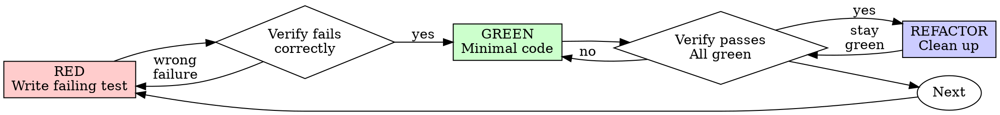

# Test-Driven Development (TDD)

## Overview

Write a failing test before writing the code that makes it pass. For bug fixes, reproduce the bug with a test before attempting a fix. Tests are proof — "seems right" is not done. A codebase with good tests is an AI agent's superpower; a codebase without tests is a liability.

## When to Use

**Always:**
- Implementing any new logic or behavior
- Fixing any bug (the Prove-It Pattern)
- Modifying existing functionality
- Adding edge case handling
- Any change that could break existing behavior

**When NOT to use:** Pure configuration changes, documentation updates, or static content changes that have no behavioral impact — validate those with the repository's appropriate check instead of a manufactured failing test.

Thinking "skip TDD just this once"? Stop. That's rationalization.

## The Iron Law

```
NO PRODUCTION CODE WITHOUT A FAILING TEST FIRST
```

Scope: the Iron Law applies to every change with behavioral impact — exactly
the "Always" list above. The non-behavioral changes in "When NOT to use" are
outside it, not exceptions to it.

Wrote behavioral production code before its test? Delete that code. Start over.

**Within that scope, no exceptions:**
- Don't keep it as "reference"
- Don't "adapt" it while writing tests
- Don't look at it
- Delete means delete

Implement fresh from tests. Period.

## Discover the Stack First

The TDD cycle is universal; the commands are not. Before writing the first test, discover how *this* repository tests, and use its commands for every RED, GREEN, and verification step:

- **Language and build system** — `package.json`, `composer.json`, `pom.xml`/`build.gradle`, `pyproject.toml`, `go.mod`, `Cargo.toml`, `Gemfile`, a `Makefile`
- **Checked-in wrappers** — prefer `./gradlew`, `./mvnw`, `make test`, or a repo script over globally installed tools
- **Test framework and configuration** — and how it runs a single focused test vs the full suite
- **Existing conventions** — where tests live, how files are named, what patterns neighboring tests follow
- **Documented commands** — README, CONTRIBUTING, and CI workflows show the commands that actually gate merges

Run the repository's focused-test command during the loop and its full-suite command before completion. Never assume a default like `npm test` — a Gradle, Cargo, or pytest project has its own equivalent.

The examples below use TypeScript for illustration; the workflow is identical in any language once you've discovered the project's own tooling.

## The TDD Cycle - Red-Green-Refactor



### Step 1: RED — Write a Failing Test

Write the test first. Run it. It must fail. For new behavior, the test must fail for the expected reason before
implementation. If it passes immediately, determine whether the behavior
already exists or the test does not exercise the intended change.

```typescript
// RED: This test fails because createTask doesn't exist yet
describe('TaskService', () => {
  it('creates a task with title and default status', async () => {
    const task = await taskService.createTask({ title: 'Buy groceries' });

    expect(task.id).toBeDefined();
    expect(task.title).toBe('Buy groceries');
    expect(task.status).toBe('pending');
    expect(task.createdAt).toBeInstanceOf(Date);
  });
});
```

### Step 2: GREEN — Make It Pass

Write the minimum code to make the test pass. Don't over-engineer:

```typescript
// GREEN: Minimal implementation
export async function createTask(input: { title: string }): Promise<Task> {
  const task = {
    id: generateId(),
    title: input.title,
    status: 'pending' as const,
    createdAt: new Date(),
  };
  await db.tasks.insert(task);
  return task;
}
```

**Test fails?** Fix code, not test.

**Other tests fail?** Fix now.

### Step 3: REFACTOR — Clean Up

With tests green, improve the code without changing behavior:

- Extract shared logic
- Improve naming
- Remove duplication
- Optimize if necessary

Run tests after every refactor step to confirm nothing broke.

## The Prove-It Pattern (Bug Fixes)

When a bug is reported, **do not start by trying to fix it.** Start by writing a test that reproduces it.

```
Bug report arrives
       │
       ▼
  Write a test that demonstrates the bug
       │
       ▼
  Test FAILS (confirming the bug exists)
       │
       ▼
  Implement the fix
       │
       ▼
  Test PASSES (proving the fix works)
       │
       ▼
  Run full test suite (no regressions)
```

**Example:**

```typescript
// Bug: "Completing a task doesn't update the completedAt timestamp"

// Step 1: Write the reproduction test (it should FAIL)
it('sets completedAt when task is completed', async () => {
  const task = await taskService.createTask({ title: 'Test' });
  const completed = await taskService.completeTask(task.id);

  expect(completed.status).toBe('completed');
  expect(completed.completedAt).toBeInstanceOf(Date);  // This fails → bug confirmed
});

// Step 2: Fix the bug
export async function completeTask(id: string): Promise<Task> {
  return db.tasks.update(id, {
    status: 'completed',
    completedAt: new Date(),  // This was missing
  });
}

// Step 3: Test passes → bug fixed, regression guarded
```

## The Test Pyramid

Invest testing effort according to the pyramid — most tests should be small and fast, with progressively fewer tests at higher levels:

```
          ╱╲
         ╱  ╲         E2E Tests (~5%)
        ╱    ╲        Full user flows, real browser
       ╱──────╲
      ╱        ╲      Feature/Integration Tests (~15%)
     ╱          ╲     Component interactions, API boundaries
    ╱────────────╲
   ╱              ╲   Unit Tests (~80%)
  ╱                ╲  Pure logic, isolated, milliseconds each
 ╱──────────────────╲
```

**Important for pyramid:** The percentages are illustrative, not quotas. Prefer the lowest test level
that proves the behavior with sufficient confidence. Integration-heavy
applications may legitimately have a different distribution.

**The Beyonce Rule:** If you liked it, you should have put a test on it. Infrastructure changes, refactoring, and migrations are not responsible for catching your bugs — your tests are. If a change breaks your code and you didn't have a test for it, that's on you.

### Test Sizes (Resource Model)

Beyond the pyramid levels, classify tests by what resources they consume:

| Size | Constraints | Speed | Example |
|------|------------|-------|---------|
| **Small** | Single process, no I/O, no network, no database | Milliseconds | Pure function tests, data transforms |
| **Medium** | Multi-process OK, localhost only, no external services | Seconds | API tests with test DB, component tests |
| **Large** | Multi-machine OK, external services allowed | Minutes | E2E tests, performance benchmarks, staging integration |

Small tests should make up the vast majority of your suite. They're fast, reliable, and easy to debug when they fail.

## Good Tests

| Quality | Good | Bad |
|---------|------|-----|
| **Minimal** | One thing. "and" in name? Split it. | `test('validates email and domain and whitespace')` |
| **Clear** | Name describes behavior | `test('test1')` |
| **Shows intent** | Demonstrates desired API | Obscures what code should do |

### Decision Guide

```
Is it pure logic with no side effects?
  → Unit test (small)

Does it cross a boundary (API, database, file system)?
  → Integration test (medium)

Is it a critical user flow that must work end-to-end?
  → E2E test (large) — limit these to critical paths
```

## Writing Good Tests

### Test State, Not Interactions

Assert on the *outcome* of an operation, not on which methods were called internally. Tests that verify method call sequences break when you refactor, even if the behavior is unchanged.

```typescript
// Good: Tests what the function does (state-based)
it('returns tasks sorted by creation date, newest first', async () => {
  const tasks = await listTasks({ sortBy: 'createdAt', sortOrder: 'desc' });
  expect(tasks[0].createdAt.getTime())
    .toBeGreaterThan(tasks[1].createdAt.getTime());
});

// Bad: Tests how the function works internally (interaction-based)
it('calls db.query with ORDER BY created_at DESC', async () => {
  await listTasks({ sortBy: 'createdAt', sortOrder: 'desc' });
  expect(db.query).toHaveBeenCalledWith(
    expect.stringContaining('ORDER BY created_at DESC')
  );
});
```

### DAMP Over DRY in Tests

In production code, DRY (Don't Repeat Yourself) is usually right. In tests, **DAMP (Descriptive And Meaningful Phrases)** is better. A test should read like a specification — each test should tell a complete story without requiring the reader to trace through shared helpers.

```typescript
// DAMP: Each test is self-contained and readable
it('rejects tasks with empty titles', () => {
  const input = { title: '', assignee: 'user-1' };
  expect(() => createTask(input)).toThrow('Title is required');
});

it('trims whitespace from titles', () => {
  const input = { title: '  Buy groceries  ', assignee: 'user-1' };
  const task = createTask(input);
  expect(task.title).toBe('Buy groceries');
});

// Over-DRY: Shared setup obscures what each test actually verifies
// (Don't do this just to avoid repeating the input shape)
```

Duplication in tests is acceptable when it makes each test independently understandable.

### Prefer Real Implementations Over Mocks

Use the simplest test double that gets the job done. The more your tests use real code, the more confidence they provide.

```
Preference order (most to least preferred):
1. Real implementation  → Highest confidence, catches real bugs
2. Fake                 → In-memory version of a dependency (e.g., fake DB)
3. Stub                 → Returns canned data, no behavior
4. Mock (interaction)   → Verifies method calls — use sparingly
```

**Use mocks only when:** the real implementation is too slow, non-deterministic, or has side effects you can't control (external APIs, email sending). Over-mocking creates tests that pass while production breaks.

### Use the Arrange-Act-Assert Pattern

```typescript
it('marks overdue tasks when deadline has passed', () => {
  // Arrange: Set up the test scenario
  const task = createTask({
    title: 'Test',
    deadline: new Date('2025-01-01'),
  });

  // Act: Perform the action being tested
  const result = checkOverdue(task, new Date('2025-01-02'));

  // Assert: Verify the outcome
  expect(result.isOverdue).toBe(true);
});
```

### One Assertion Per Concept

```typescript
// Good: Each test verifies one behavior
it('rejects empty titles', () => { ... });
it('trims whitespace from titles', () => { ... });
it('enforces maximum title length', () => { ... });

// Bad: Everything in one test
it('validates titles correctly', () => {
  expect(() => createTask({ title: '' })).toThrow();
  expect(createTask({ title: '  hello  ' }).title).toBe('hello');
  expect(() => createTask({ title: 'a'.repeat(256) })).toThrow();
});
```

### Name Tests Descriptively

```typescript
// Good: Reads like a specification
describe('TaskService.completeTask', () => {
  it('sets status to completed and records timestamp', ...);
  it('throws NotFoundError for non-existent task', ...);
  it('is idempotent — completing an already-completed task is a no-op', ...);
  it('sends notification to task assignee', ...);
});

// Bad: Vague names
describe('TaskService', () => {
  it('works', ...);
  it('handles errors', ...);
  it('test 3', ...);
});
```

## Test Anti-Patterns to Avoid

| Anti-Pattern | Problem | Fix |
|---|---|---|
| Testing implementation details | Tests break when refactoring even if behavior is unchanged | Test inputs and outputs, not internal structure |
| Flaky tests (timing, order-dependent) | Erode trust in the test suite | Use deterministic assertions, isolate test state |
| Testing framework code | Wastes time testing third-party behavior | Only test YOUR code |
| Snapshot abuse | Large snapshots nobody reviews, break on any change | Use snapshots sparingly and review every change |
| No test isolation | Tests pass individually but fail together | Each test sets up and tears down its own state |
| Mocking everything | Tests pass but production breaks | Prefer real implementations > fakes > stubs > mocks. Mock only at boundaries where real deps are slow or non-deterministic |

## When to Use Subagents for Testing

For complex bug fixes, spawn a subagent to write the reproduction test:

```
Main agent: "Spawn a subagent to write a test that reproduces this bug:
[bug description]. The test should fail with the current code."

Subagent: Writes the reproduction test

Main agent: Verifies the test fails, then implements the fix,
then verifies the test passes.
```

This separation ensures the test is written without knowledge of the fix, making it more robust.

## See Also

For JavaScript/TypeScript testing patterns illustrating these principles — Jest, React Testing Library, Supertest, Playwright — see `../../references/testing-patterns.md`. The principles transfer to any ecosystem; the syntax and tools there are JS/TS-specific.

## Common Rationalizations

| Rationalization | Reality |
|---|---|
| "I'll write tests after the code works" | You won't. And tests written after the fact test implementation, not behavior. |
| "This is too simple to test" | Simple code gets complicated. The test documents the expected behavior. |
| "Tests slow me down" | Tests slow you down now. They speed you up every time you change the code later. |
| "I tested it manually" | Manual testing doesn't persist. Tomorrow's change might break it with no way to know. |
| "The code is self-explanatory" | Tests ARE the specification. They document what the code should do, not what it does. |
| "It's just a prototype" | Prototypes become production code. Tests from day one prevent the "test debt" crisis. |
| "Let me run the tests again just to be extra sure" | After a clean test run, repeating the same command adds nothing unless the code has changed since. Run again after subsequent edits, not as reassurance. |

## Red Flags

Process flags — these mean **delete the untested behavioral production code
and restart with TDD**:

- Writing behavioral code without a prior failing test
- "Keep as reference" or "adapt existing code"
- "Already spent X hours, deleting is wasteful"
- "TDD is dogmatic, I'm being pragmatic"
- "This is different because..."

Quality flags — these mean **fix the named problem in place** (the delete rule
does not apply to them):

- Reaching for a default test command (`npm test`) without checking what this repository actually uses → discover the stack
- Tests that pass on the first run → verify per Step 1: does the behavior already exist, or does the test not exercise the change?
- "All tests pass" but no tests were actually run → run them
- Bug fixes without reproduction tests → write the reproduction test now, confirm it fails on the pre-fix code
- Tests that test framework behavior instead of application behavior → retarget to your code
- Test names that don't describe the expected behavior → rename
- Skipping or disabling tests to make the suite pass → unskip and fix
- Running the same test command twice in a row without any intervening code change → stop; act on the evidence you have

## Verification

After completing any implementation:

- [ ] Every new behavior has a corresponding test
- [ ] The full suite passes, run with the repository's own test command (`npm test`, `./gradlew test`, `pytest`, `go test ./...`, ...)
- [ ] Bug fixes include a reproduction test that failed before the fix
- [ ] Test names describe the behavior being verified
- [ ] No tests were skipped or disabled
- [ ] Coverage hasn't decreased (if tracked)
- [ ] The change introduces no new errors or warnings in test/build output (pre-existing ones unrelated to the change are reported, not silently fixed — that's scope expansion)
- [ ] Test doubles follow the preference order (real > fake > stub > mock); mocks appear only at boundaries that are slow, non-deterministic, or side-effecting
- [ ] Edge cases and errors covered

**Note:** Run each test command after a change that could affect the result. After a clean run, don't repeat the same command unless the code has changed since — re-running on unchanged code adds no confidence.
